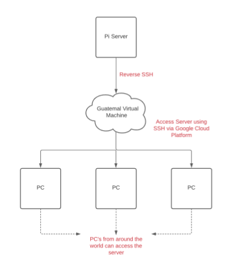
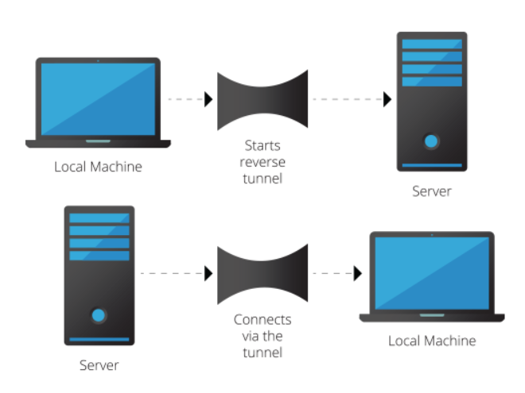
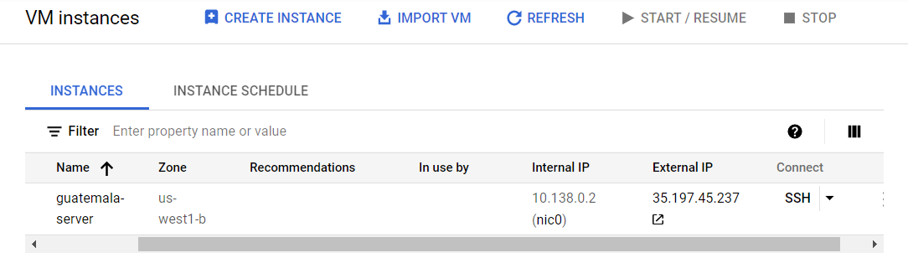
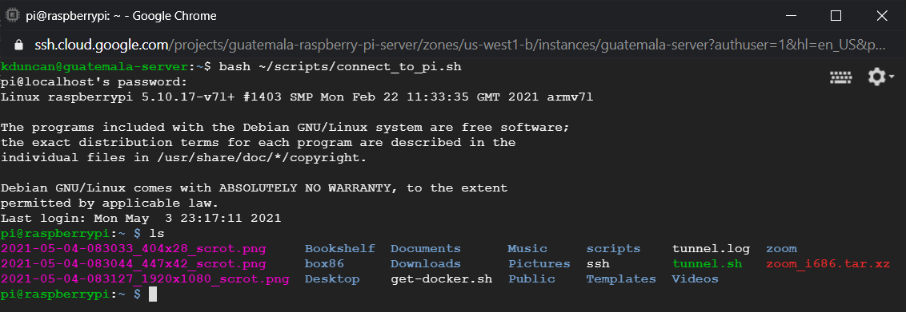
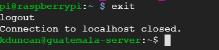

# Remote Pi Server

## Overview

This project serves as a solution to a problem received in a networks course. The scope of the project was to come up with a simple and cost effective solution for
the Church of the Nazarene to implement in third world countries where the church has education centers. The goal of the project was to provide a system with minimal
on site maintence/setup. The purpose of implementing this solution is to provide students attending the church's education centers with the opportunity to
pursue higher education via virtual learning.

<p class='center'>
  
</p>

## Project Requirements

- Server needs to have minimal on-site maintence and setup
- Low cost of on-site hardware
- Easy to replace
- Secure
- Zoom for virtual classroom support

## Solution

A Raspberry Pi computer is a low cost server solution that can easily be installed and replaced on-site. In combination with a virtual machine hosted on a cloud provider
(in this case Google Cloud Platform), the Raspberry Pi server can be accessed from anywhere in the world. This provides the church with the ability to support remote
administration of the on-site server, meaning that those on-site need little to no experience to setup the server. The server is sent to the remote location with
pre-installed scripts to support the installation of required software (Zoom) and setup the Raspberry Pi for reverse SSH.

## How it Works

In order to control the Raspberry Pi remotely remote SSH is used. Reverse SSH is a technique through which you can access systems that are behind a firewall from the outside
world. Reverse SSH works by creating a tunnel from the Raspberry Pi to the cloud hosted virtual machine in which the virtual machine can then control the Raspberry Pi server
using port forwarding. This works by assigning a socket to listen to the port on the remote virtual machine side, and whenever a connection is made to this port, the connection
is forwarded over the secure channel, and a connection is made to the host port from the Raspberry Pi server. In short, reverse SSH allows the ability to connect the Raspberry
Pi to a virtual machine, so that a tunnel can be used to connect from the virtual machine to the Raspberry Pi server and remotely administer the server.

<p class='center'>
  
</p>

## Steps

### 1. Setting Up a Virtual Machine on Google Cloud Platform

To setup GCP to host our virtual machine, a GCP account needs to be created. Once an account is created the following [script](setup_gcloud.sh) can be modified and ran on the
Raspberry Pi server to setup the virtual machine on the cloud:

```bash
#!/bin/bash
# install google cloud platform CLI (command-line interface)
sudo apt update -y && sudo apt-get update -y && sudo apt-get upgrade -y && sudo apt dist-upgrade -y && sudo apt-get autoremove -y && sudo apt-get clean -y && sudo apt-get autoclean -y && sudo apt-get install software-properties-common build-essential cmake git wget curl mosh vim mlocate postgresql rclone nginx gunicorn python3-pip ca-certificates gnupg apt-transport-https -y && curl -sL https://deb.nodesource.com/setup_12.x | sudo -E bash - && sudo apt-get install -y nodejs
echo "deb http://packages.cloud.google.com/apt cloud-sdk main" | sudo tee -a /etc/apt/sources.list.d/google-cloud-sdk.list && curl https://packages.cloud.google.com/apt/doc/apt-key.gpg | sudo apt-key add - && sudo apt-get update && sudo apt-get install google-cloud-sdk && sudo apt-get install google-cloud-sdk-app-engine-python && sudo apt-get install google-cloud-sdk-app-engine-python-extras -y
gcloud init # sign into your google cloud account
gcloud auth list # check that your account is authorized and active
gcloud alpha billing accounts list # use to view billing ID

# replace PROJECTNAME and BILLING ID with the desired name of the project and your account's billing ID
gcloud projects create PROJECTNAME && gcloud config set project PROJECTNAME && gcloud beta billing projects link PROJECTNAME --billing-account=BILLINGID
gcloud projects list

# replace VMINSTANCENAME with the name you want to name your cloud Virtual Machine instance
gcloud compute instances create "VMINSTANCENAME" --boot-disk-device-name "VMINSTANCENAME" --zone us-central1-f --machine-type f1-micro --image-project ubuntu-os-cloud --image-family ubuntu-2004-lts --boot-disk-size 30 --boot-disk-type "pd-standard" --maintenance-policy "MIGRATE" --tags http-server,https-server --scopes cloud-platform

# replace firewall names with whatever names suit your application
gcloud compute firewall-rules create FIREWALLNAME1 --allow tcp:5000 --direction=INGRESS && gcloud compute firewall-rules create FIREWALLNAME2 --allow tcp:5001 --direction=INGRESS && gcloud compute firewall-rules create FIREWALLNAME3 --allow udp:60000-61000  --direction=INGRESS
gcloud compute firewall-rules list

# replace USERNAME with the username of the google cloud platform account, replace timezone with the timezone that the instance is hosted in
gcloud compute instances add-tags USERNAME --zone TIMEZONE --tags=http-server,https-server

# replace USERNAME with the username of the google cloud platform account, replace VMINSTANCENAME with the name of the VM, replace IPINSTANCE with the external IP address of the VM instance
ssh-keygen -t rsa && cat ~/.ssh/id_rsa.pub > NAME.txt && sed -i '1s/^/USERNAME:/' NAME.txt && sed -i 's/\=.*/= USERNAME/' NAME.txt && gcloud compute instances add-metadata VMINSTANCENAME --zone=us-central1-f --metadata-from-file ssh-keys=NAME.txt && ssh USERNAME@IPINSTANCE
```

Notice that the virtual machine is given the public SSH generated on the Raspberry Pi. This allows the virtual machine to securely connect to the server. Once setup, something
like the following should show up on your GCP account:

<p class='center'>
  
</p>

From the GCP website, users can be granted access to login into the virtual machine. Logged in users will appear on the virtual machine as user@VM_NAME. "Users" in this case are
individuals who are to be granted access to the Raspberry Pi to provide technincal support.

### 2. Setting Up the Raspberry Pi Server

#### I. Modify Tunneling Script

On bootup of the server the Raspberry Pi's micro SD card will already contain [scripts](https://github.com/KDunc11/RemotePiServer/src/server/scripts) that can be modified and run
to support setup of the server. The first script modify on the server is the [tunnel.sh](tunnel.sh) script.

```bash
#!/bin/bash
createTunnel(){
  /usr/bin/ssh -N -R 60000:localhost:22 emailuser@EXTERNALIP # replace emailuser with the name of an email account that is granted access to the virtual machine
                                                             # replace EXTERNALIP with the external IP address of the virtual machine, can be obtained from GCP

  if [[ $? -eq 0 ]]; then
    echo Tunnel to jumpbox created successfully
  else
    echo Error creating a tunnel to jumpbox. RC was $?
  fi
}
/bin/pidof ssh
if [[ $? -ne 0 ]]; then
  echo Creating new tunnel connection
  createTunnel
fi
```

#### II. Setup Tunneling

Next run the setup [script](setup_raspberrypi.sh) for the Raspberry Pi:

```bash
#!/bin/bash
chmod 700 ~/tunnel.sh
crontab -e

# paste this into the terminal when the crontab -e opens => */1 * * * * ~/tunnel.sh > tunnel.log 2>&1
```

This script will setup the tunnel for reverse SSH to always be running so that the server can be remotely administered at any given time.

#### III. Start the Server

Now the server can be started using the following [script](start_server.sh):

```bash
#!/bin/bash
sudo service ssh restart # may have to enter the Raspberry Pi's password
# replace USERNAME with name of google cloud platform account username, replace IPINSTANCE with the external IP address of the VM instance
ssh -N -R 6000:localhost:22 USERNAME@IPINSTANCE
```

A prompt should appear to enter in the password given for the SSH key during key generation. Now that the server is started, a user can connect to the virtual machine
on the cloud and connect to the server to do any remote administrative work.

### 3. Connecting to the Raspberry Pi

Now that the server is setup for remote SSH connection a user can login to the virtual machine and use the following [command](connect_to_pi.sh) to connect to the server:

```bash
# replace PINAME with the name of the Raspberry Pi
ssh -p 6000 PINAME@localhost
```

The user will have to enter the password assigned to the Raspberry Pi on bootup of the server. The command could be made into a simple script and executed by running the script. For example:

<p class='center'>
  
</p>

From here the user can setup Zoom on the server by using the following [script](setup_zoom.sh):

```bash
#!/bin/bash
# install Zoom dependencies
sudo apt update && sudo apt full-upgrade
sudo apt install git build-essential cmake
git clone https://github.com/ptitSeb/box86
cd ~/box86 && mkdir build && cd build

# Raspberry Pi 4 Command
cmake .. -DRPI4=1 -DCMAKE_BUILD_TYPE=RelWithDebInfo

# Raspberry Pi 3 Command
# cmake .. -DRPI3=1 -DCMAKE_BUILD_TYPE=RelWithDebInfo

# Raspberry Pi 2 Command
# cmake .. -DRPI2=1 -DCMAKE_BUILD_TYPE=RelWithDebInfo

make -j$(nproc)
sudo make install
sudo systemctl restart systemd-binfmt

# install Zoom
sudo apt-get install libxcb-xtest0
cd ~
wget https://zoom.us/client/5.4.53391.1108/zoom_i686.tar.xz
tar xvf zoom_i686.tar.xz
```

Note that the script depends on the model of the Raspberry Pi. Uncomment the line corresponding to the model of your server (Raspberry Pi 2, 3, 4). Any additional commands can
be executed through command line by the user to provide assitance to the education center in which the server exists. For example this is a [script](run_zoom.sh) to start Zoom:

```bash
#!/bin/bash
# launches the Zoom desktop application on the Raspberry Pi. May take a few seconds to launch, initial launch of Zoom on the Pi takes a while.
cd /home/pi/zoom && ./zoom
```

#### 4. Exiting the Server from the Virtual Machine

To exit from the Raspberry Pi server from the virtual machine shell simply use the exit command.

<p class='center'>
  
</p>
